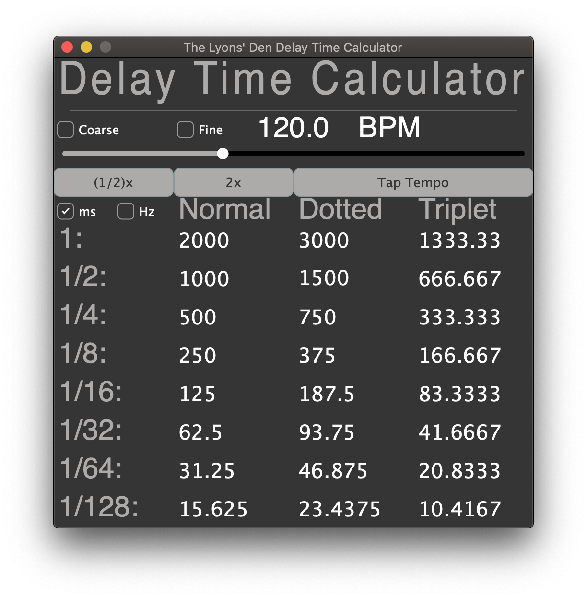

# GUI-Delay-Time-Calculator
A simple application that calculates delay and reverb pre-delay times based on the tempo the user inputs.  Alternaively, it can display the values in terms of Hertz, which may be helpful for syncing synthesizer LFOs in time.

-Image may not be the same size as the actual GUI

## Features:

* Delay times calculated for: 1, 1/2, 1/4, 1/8, 1/16, 1/32, 1/64, and 1/128 note values.  Each note value has associated values for Normal, Dotted, and Triplet.
* Option to show values in terms of Hertz, which might be useful for setting synth LFOs.
* A slider for user input of tempo, from 1 - 1000 bpm.  The user can also input their tempo by clicking the text box above slider.  Holding down command will give finer control over the slider.
* Ability to calculate tempo from entering values directly into the ms and Hz fields.
* User can choose from whole, tenths, or hundredths resolution, for tempo increments.
* 1/2x and 2x buttons to quickly double or half the current tempo.  This may be useful if you need to get faster or slower times than the ones available on the screen.
* Tap to set tempo with Tap Tempo.  The tapping algorithm automatically resets itself after a time interval equal to 4 times the length of the current tapping interval.  Note: The first time you click, the tempo slider will move to 1.  This is not a bug, this is the nature of calculating the tempo based on taps.  Two taps are needed to obtain the first calculation.  So the slider is set to 1 during the first tap, then, the correct bpm is reported on the second tap.
* Keys: 1 = 1/2x, 2 = 2x, T = Tap Tempo, R = Reset Tap Tempo, 'M' enables ms, 'H' enables Hz, 'Spacebar = Round Value, Up Arrow = +1, Down Arrow = -1, Right Arrow = +5, Left Arrow = -5, C = Coarse Resolution, S = Standard Resolution, F = Fine Resolution
* An information panel that contains links to our email, our Facebook page, to the code repository, and the donations page.  It also displays the keys that trigger actions and the version number.  This information window is displayed when the user clicks on the main Delay Time Calculator label.
