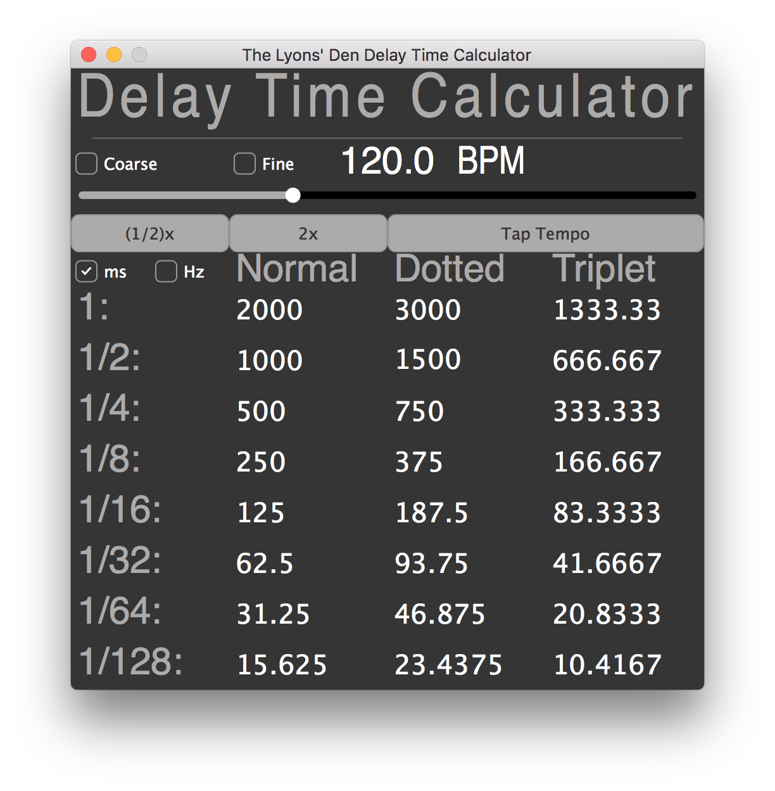

# GUI-Delay-Time-Calculator
A simple application that calculates delay and reverb pre-delay times based on the tempo the user inputs.  Alternaively, it can display the values in terms of Hertz, which may be helpful for syncing synthesizer LFOs in time.

-Image is larger than the actual GUI

## Features:

* Delay times calculated for: 1, 1/2, 1/4, 1/8, 1/16, 1/32, 1/64, and 1/128 note values.  Each note value has associated values for Normal, Dotted, and Triplet values.
* Option to show values in terms of Hertz, which might be useful for setting synth LFOs.
* A slider for user input of tempo, from 1 - 1000 bpm.  The user can also input their tempo by clicking the text box above slider.  Holding down command will give finer control over the slider.
* Options of using bpm intervals of (X), (0.X), or (0.0X)
* User can choose from whole, tenths, or hundredths resolution, for tempo increments.
* 1/2x and 2x buttons to quickly double or half the current tempo.  This may be useful if you need to get faster or slower times than the ones available on the screen.
* Tap to set tempo with Tap Tempo.  Some tap tempo functions in other software will only measure the time between two hits, some will average a few intervals together, however, my algorithm averages the intervavls in between every single hit.  I find this to be more accurate as you can click 10-15 times to really hone in on a specific tempo.  Fluctuations won't matter as much the more taps you put in.  The only downfall to this is is that once you start tapping, the algoritm never stops measuring time, so to combat this, the algorithm is automatically reset whenever the mouse leaves the boundaries of the Tap Tempo button or whenever the mouse moves at all after using the 'T' key to trigger the Tap Tempo button.  If the user wants to manually reset the function (without moving the mouse), they can hit the 'R' key.  For more visual feedback of the algorithm, a tap count is recorded (v1.6.0) and displayed directly in the Tap Tempo button text.  Note: The first time you click, the tempo slider will move to 1.  This is not a bug, this is the nature of calculating the tempo based on taps.  Two hits are needed to obtain the first calculation.  So I set the slider to 1 during the first hit then, then move it to the correct tempo on the second hit.
* Keys: 1 = 1/2x, 2 = 2x, T = Tap Tempo, R = Reset Tap Tempo, 'M' enables ms, 'H' enables Hz, 'Spacebar = Round Value, Up Arrow = +1, Down Arrow = -1, Right Arrow = +5, Left Arrow = -5, C = Coarse Resolution, S = Standard Resolution, F = Fine Resolution
* An information panel that contains links to our email, our Facebook page, to the code repository, and the donations page.  It also displays the keys that trigger actions and the version number.  This information window is displayed when the user clicks on the main Delay Time Calculator window.
